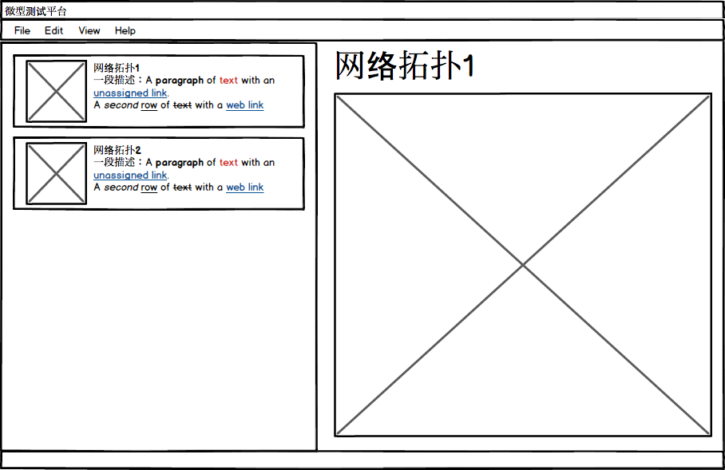

# 任务列表

## 2017年03月14日

### 后端

#### 虚拟机控制

实现下述功能，具体方法定义见[Hypervisor](mt_core/backends/__init__.py)里的Hypervisor类，下面两个类继承了这个类。

- [VirtualBox](mt_core/backends/virtualbox.py)，实现`VirtualBox`类的`clone`、`power_on`、`power_off`方法。
- [Workstation](mt_core/backends/workstation.py)，实现`Workstation`类的`clone`、`power_on`、`power_off`方法。

#### 基础框架

- [server](mt_core/server.py)，利用Python自带的XMLRPC库编写服务器接收网络请求，并在收到请求后调用对应的on_*函数。
- [config](mt_core/config.py)，利用Python自带的ConfigParser库读取配置文件[conf/mt.cfg](conf/mt.cfg)，覆盖`Config`类的对应字段。
- [topo](mt_core/topo.py)，主要学习解析XML文件的方法，自己写代码测试一下，这个文件暂时不用改。

### 前端

实现下面这个界面：

